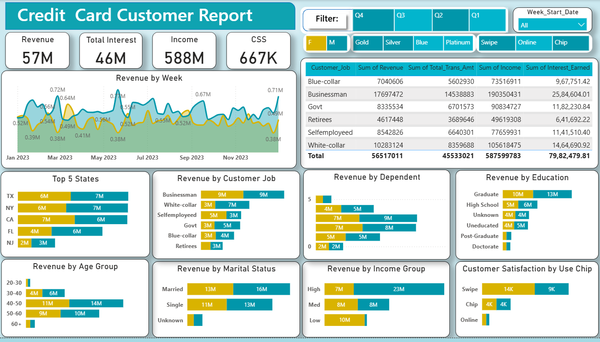
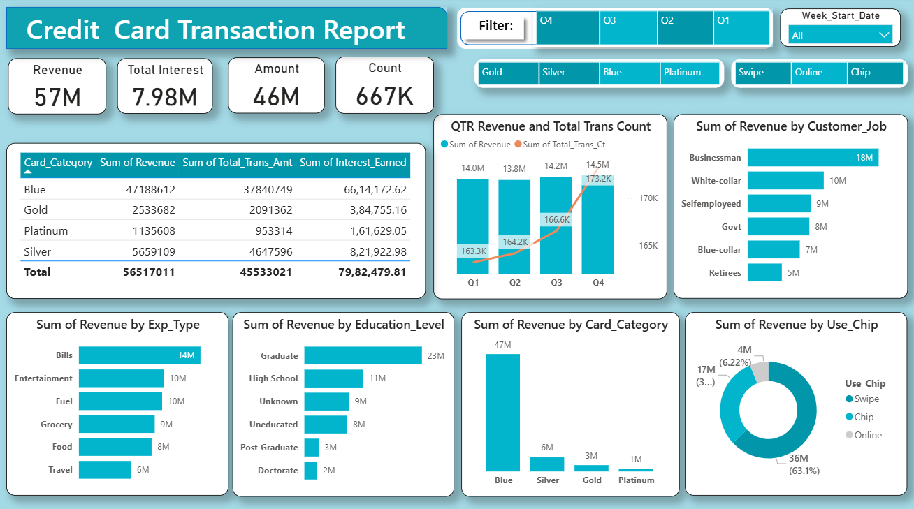

# 💳 Credit Card Financial Dashboard

A Power BI dashboard project that provides comprehensive insights into credit card customer behavior, revenue trends, transaction patterns, customer segmentation and key business KPIs.

## 📈 Dashboard Preview

### Credit Card Customer Dashboard

### Credit Card Transaction Dashboard

### Executive Summary

This project presents a comprehensive Credit Card Financial Analytics Dashboard developed in Power BI to analyze customer behavior, transaction patterns, revenue generation, and profitability metrics.

The dashboard enables stakeholders to monitor key business KPIs, identify high-value customer segments, evaluate spending trends, and support data-driven decision-making.

Business Impact

✔ Identified customer segments contributing maximum revenue

✔ Analyzed transaction behavior across payment channels

✔ Evaluated customer satisfaction and engagement metrics

✔ Monitored quarterly revenue growth and profitability

✔ Delivered interactive dashboards for executive reporting

### Project Overview Business Problem

Financial institutions generate large volumes of customer and transaction data daily. Without proper analytics, identifying profitable customers, spending behavior, and revenue opportunities becomes challenging.

This project addresses these challenges through interactive Power BI dashboards that transform raw transactional data into actionable business insights.

Solution

A two-dashboard Power BI solution was developed:

| Dashboard             | Purpose                                                        |
| --------------------- | -------------------------------------------------------------- |
| Customer Dashboard    | Customer demographics, revenue analysis, customer satisfaction |
| Transaction Dashboard | Transaction behavior, spending categories, payment methods     |

### Key Performance Indicators

| KPI                | Value |
| ------------------ | ----- |
| Revenue            | 57M   |
| Interest Earned    | 46M   |
| Total Income       | 588M  |
| Transaction Amount | 46M   |
| Total Transactions | 667K  |

# 📈 Key Insights

<h2>📊 Customer Dashboard Insights</h2>

<ul>
    <li>Businessman customers generate the highest revenue among all occupation groups.</li>
    <li>Graduate customers contribute the largest share of revenue compared to other education levels.</li>
    <li>Married customers represent the most profitable customer segment.</li>
    <li>Customers aged 40–50 years contribute the highest revenue.</li>
    <li>Revenue shows noticeable growth during certain periods of the year, indicating seasonal spending behavior.</li>
    <li>Swipe card users generate higher revenue than online and chip-based transactions.</li>
    <li>High-income customers contribute significantly more revenue than medium- and low-income groups.</li>
</ul>

<h2>💳 Transaction Dashboard Insights</h2>

<ul>
    <li>Total Revenue reached 57M with 667K transactions, indicating strong transaction volume.</li>
    <li>Swipe transactions account for the majority of transaction revenue.</li>
    <li>The Blue Card category generates the highest revenue among all card types.</li>
    <li>Bills, Entertainment, and Fuel are the top spending categories.</li>
    <li>Revenue and transaction count consistently increased from Q1 to Q4.</li>
    <li>Businessman and White-collar customers contribute the highest transaction revenue.</li>
    <li>Graduate customers demonstrate higher spending behavior compared to other education groups.</li>
    <li>Platinum cards represent a smaller customer base but contribute premium-value transactions.</li>
</ul>

<h2>🎯 Executive Business Findings</h2>

<ul>
    <li>Revenue is primarily driven by middle-aged, married, graduate, and high-income customers.</li>
    <li>Swipe remains the preferred payment method for credit card transactions.</li>
    <li>Blue Card customers form the largest and most valuable customer segment.</li>
    <li>Customer occupation, education level, and income group strongly influence revenue generation.</li>
    <li>Quarterly performance analysis indicates positive business growth and increasing customer engagement.</li>
</ul>
